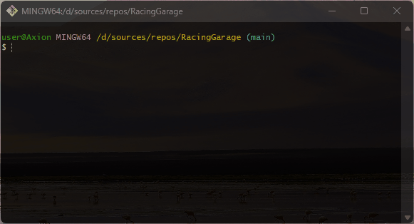

# 🚗 RacingGarage
car features and comparing multiple cars

## 💻 About Program
*This program uses OOP principles to operate on machine data.*

### 🪟 Preview                                                  

### ⚙️ Technologies
 

## 🧑‍💻 I worked on it
- *namespaces*
- *Keywords: using, static*
- *OOP principles: Encapsulation, class, object, methods, properties*
- *Classes: Console, ConsoleColor*
- *Convert methods: Parse*
- *Data types: int, string, double, DateTime*
- *Strings: Interpolated string, Regular string*
- *Collections: array*
- *Loops: for, while, foreach*
- *Selection statements: if else, ternary operator*

## 🤝 Future development
*Make the GUI look more understandable, move cars by fuel, sort by speed*