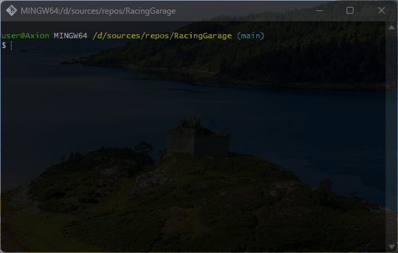

# 🚗 RacingGarage
car features and comparing multiple cars

## 💻 About Program
*This program uses OOP principles to operate on machine data.*

### 🪟 Preview                                                  

### ⚙️ Technologies
 

## 🧑‍💻 I worked on it
- *namespaces*
- *Keywords: using*
- *OOP principles: class, object, methods, properties*
- *Classes: Console*
- *Convert methods: Parse*
- *Data types: int, string, double*
- *Strings: Interpolated string, Regular string*
- *Collections: arrays*
- *Loops: while, foreach*
- *Selection statements: if*

## 🤝 Future development
*Advanced: Organize car races and create a GUI race, even if it's partially on the console*